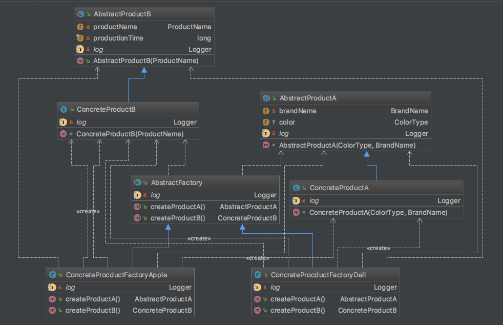

# 抽象工厂方法模式

> 抽象工厂模式（Abstract Factory Pattern）是围绕一个超级工厂创建其他工厂。
该超级工厂又称为其他工厂的工厂。这种类型的设计模式属于创建型模式，它提供了一种创建对象的最佳方式。

> 在抽象工厂模式中，接口是负责创建一个相关对象的工厂，不需要显式指定它们的类。
每个生成的工厂都能按照工厂模式提供对象。

## 1 介绍

### 1.1 模式动机

> 提供一个创建一系列相关或相互依赖对象的接口，而无需指定它们具体的类。

### 1.2 模式定义

> 抽象工厂模式(Abstract Factory Pattern)：提供一个创建一系列相关或相互依赖对象的接口，
而无须指定它们具体的类。抽象工厂模式又称为Kit模式，属于对象创建型模式。

### 1.3 适用环境

> * 一个系统不应当依赖于产品类实例如何被创建、组合和表达的细节，这对于所有类型的工厂模式都是重要的。
> * 系统中有多于一个的产品族，而每次只使用其中某一产品族。
> * 属于同一个产品族的产品将在一起使用，这一约束必须在系统的设计中体现出来。
> * 系统提供一个产品类的库，所有的产品以同样的接口出现，从而使客户端不依赖于具体实现。

### 1.4 模式应用

> * 在很多软件系统中需要更换界面主题，要求界面中的按钮、文本框、
背景色等一起发生改变时，可以使用抽象工厂模式进行设计。

### 1.5 优点

> * 抽象工厂模式隔离了具体类的生成，使得客户并不需要知道什么被创建。
由于这种隔离，更换一个具体工厂就变得相对容易。所有的具体工厂都实现了抽象工厂中定义的那些公共接口，
因此只需改变具体工厂的实例，就可以在某种程度上改变整个软件系统的行为。
另外，应用抽象工厂模式可以实现高内聚低耦合的设计目的，因此抽象工厂模式得到了广泛的应用。
> * 当一个产品族中的多个对象被设计成一起工作时，它能够保证客户端始终只使用同一个产品族中的对象。
这对一些需要根据当前环境来决定其行为的软件系统来说，是一种非常实用的设计模式。
> * 增加新的具体工厂和产品族很方便，无须修改已有系统，符合“开闭原则”。

### 1.6 缺点

> * 在添加新的产品对象时，难以扩展抽象工厂来生产新种类的产品，
这是因为在抽象工厂角色中规定了所有可能被创建的产品集合，要支持新种类的产品就意味着要对该接口进行扩展，
而这将涉及到对抽象工厂角色及其所有子类的修改，显然会带来较大的不便。
> * 开闭原则的倾斜性（增加新的工厂和产品族容易，增加新的产品等级结构麻烦）。

### 1.7 模式结构

> 工厂方法模式包含如下角色：

> * AbstractProduct：抽象产品
> * ConcreteProduct：具体产品
> * AbstractFactory：抽象工厂
> * ConcreteFactory：具体工厂

> 类图：

### 1.8 时序图

## 2 代码分析

> 抽象工厂类 AbstractFactory：
    
    public abstract class AbstractFactory {
    
        public abstract AbstractProductA createProductA();
        public abstract ConcreteProductB createProductB();
    }

> 具体工厂类 AbstractProduct：

    public class ConcreteProcductFactoryApple extends AbstractFactory{
    
    
        @Override
        public AbstractProductA createProductA() {
            log.info("-*--*--*--*- apple 生产 ProductA -*--*--*--*--");
            return new ConcreteProductA(AbstractProductA.ColorType.RED,AbstractProductA.BrandName.APPLE);
        }
    
        @Override
        public ConcreteProductB createProductB() {
            log.info("-*--*--*--*- apple 生产 ProductB -*--*--*--*--");
            return new ConcreteProductB(AbstractProductB.ProductName.TV);
        }
    }
    
> 具体产品类 ConcreteProductA：

    @Slf4j
    public class ConcreteProductA extends AbstractProductA{
    
        ConcreteProductA(ColorType colorType,BrandName brandName) {
            
            super(colorType,brandName);
        }
    }

> 具体产品类 ConcreteProductB：

    public class ConcreteProductB extends AbstractProductB{
   
       ConcreteProductB(ProductName productName) {
           super(productName);
       }
    }

> 客户端 Client：

    public class Client {
    
        public static void main(String[] args) {
    
            AbstractProductA appleProductA = new ConcreteProcductFactoryApple().createProductA();
            AbstractProductB appleProductB = new ConcreteProcductFactoryApple().createProductB();
    
            AbstractProductA dellProductA = new ConcreteProcductFactoryDell().createProductA();
            AbstractProductB dellProductB = new ConcreteProcductFactoryDell().createProductB();
    
        }
    }

## 3 模式分析

## 4 实例

## 模式扩展

### “开闭原则”的倾斜性

> * “开闭原则”要求系统对扩展开放，对修改封闭，通过扩展达到增强其功能的目的。
对于涉及到多个产品族与多个产品等级结构的系统，其功能增强包括两方面：
>>> * 1、 增加产品族：对于增加新的产品族，工厂方法模式很好的支持了“开闭原则”，对于新增加的产品族，
只需要对应增加一个新的具体工厂即可，对已有代码无须做任何修改。
>>> * 2、 增加新的产品等级结构：对于增加新的产品等级结构，需要修改所有的工厂角色，包括抽象工厂类，
在所有的工厂类中都需要增加生产新产品的方法，不能很好地支持“开闭原则”。
> * 抽象工厂模式的这种性质称为“开闭原则”的倾斜性，抽象工厂模式以一种倾斜的方式支持增加新的产品，
它为新产品族的增加提供方便，但不能为新的产品等级结构的增加提供这样的方便。

### 工厂模式的退化

> * 当抽象工厂模式中每一个具体工厂类只创建一个产品对象，也就是只存在一个产品等级结构时，
抽象工厂模式退化成工厂方法模式；当工厂方法模式中抽象工厂与具体工厂合并，
提供一个统一的工厂来创建产品对象，并将创建对象的工厂方法设计为静态方法时，
工厂方法模式退化成简单工厂模式。

## 总结

> * 抽象工厂模式提供一个创建一系列相关或相互依赖对象的接口，而无须指定它们具体的类。
抽象工厂模式又称为Kit模式，属于对象创建型模式。
> * 抽象工厂模式包含四个角色：抽象工厂用于声明生成抽象产品的方法；
具体工厂实现了抽象工厂声明的生成抽象产品的方法，生成一组具体产品，这些产品构成了一个产品族，
每一个产品都位于某个产品等级结构中；抽象产品为每种产品声明接口，
在抽象产品中定义了产品的抽象业务方法；具体产品定义具体工厂生产的具体产品对象，
实现抽象产品接口中定义的业务方法。
> * 抽象工厂模式是所有形式的工厂模式中最为抽象和最具一般性的一种形态。
抽象工厂模式与工厂方法模式最大的区别在于，工厂方法模式针对的是一个产品等级结构，
而抽象工厂模式则需要面对多个产品等级结构。
> * 抽象工厂模式的主要优点是隔离了具体类的生成，使得客户并不需要知道什么被创建，
而且每次可以通过具体工厂类创建一个产品族中的多个对象，增加或者替换产品族比较方便，
增加新的具体工厂和产品族很方便；主要缺点在于增加新的产品等级结构很复杂，
需要修改抽象工厂和所有的具体工厂类，对“开闭原则”的支持呈现倾斜性。
> * 抽象工厂模式适用情况包括：一个系统不应当依赖于产品类实例如何被创建、组合和表达的细节；
系统中有多于一个的产品族，而每次只使用其中某一产品族；属于同一个产品族的产品将在一起使用；
系统提供一个产品类的库，所有的产品以同样的接口出现，从而使客户端不依赖于具体实现。
